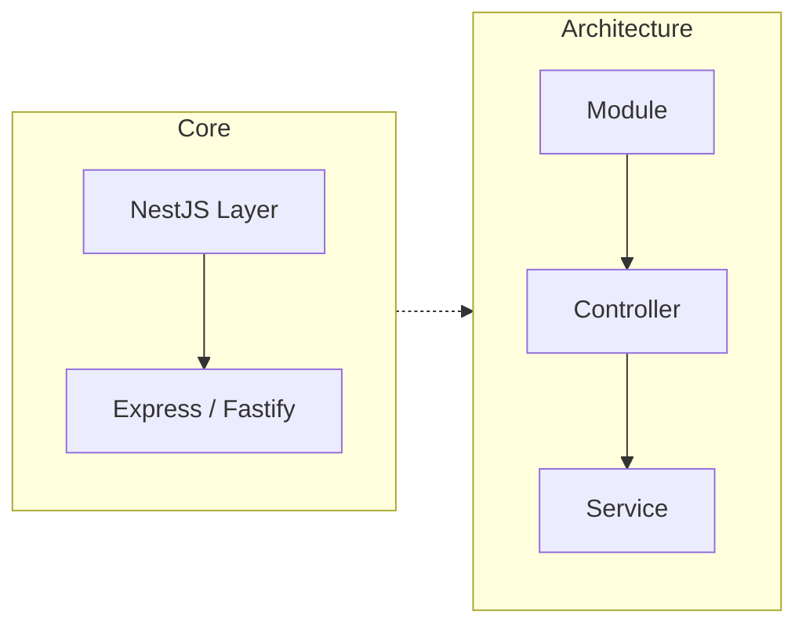
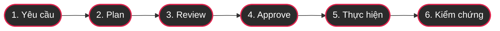
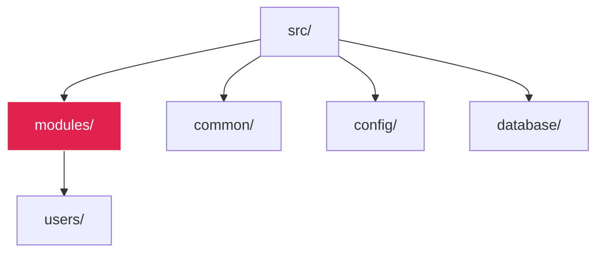
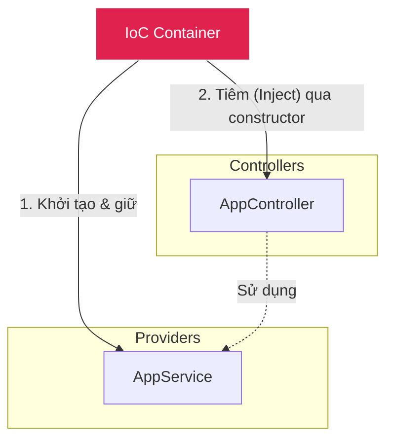

# Tạo Users API đầu tiên với NestJS + AI | NestJS từ số 0 #1

- **Series:** Học NestJS bằng AI — tập 1/45
- **Trạng thái:** ✅ Đã đăng
- **Title đã đăng:** Tạo Users API đầu tiên với NestJS + AI | NestJS từ số 0 #1
- **YouTube:** https://www.youtube.com/watch?v=7lRvCk_CHLs
- **Ngày đăng:** 2026-09-15
- **Thời lượng thực tế:** 10:41
- **Định dạng:** Host tự quay màn hình + tự thoại âm. Không AI voice, không AI footage.
- **AI tool:** Opus trong Antigravity IDE; có thể thay bằng coding agent khác nhưng giữ nguyên workflow.
- **Technical baseline:** NestJS, Node.js, npm, Vitest và ES module theo lựa chọn trong Nest CLI tại thời điểm quay.
- **Target runtime:** 10:41 (thời lượng video đã đăng)
- **Audience:** Dev mới vào nghề / Fresher — lần đầu chạm backend framework.
- **Outcome chính:** Hiểu đường đi của một request và chạy được Users API trong `src/modules/users` bằng mảng in-memory.
- **Pain mở tập 2:** DTO khai báo `email` là string nhưng payload số vẫn lọt qua vì chưa có validation runtime.

---

## PART 1 — TRANSCRIPT VIDEO ĐÃ ĐĂNG (LÀM SẠCH)

### 0:00 — Giới thiệu series NestJS cùng AI

Chào mừng các bạn đến với series học NestJS cùng với AI. Hiện nay có khá nhiều series NestJS ở trên YouTube rồi, nhưng đa số đã làm từ khá lâu và chưa áp dụng AI vào trong quá trình phát triển. Vì vậy mình làm series này để chúng ta vừa học NestJS, vừa biết cách dùng AI như một coding agent.

### 0:20 — NestJS, Express/Fastify, Module–Controller–Service

NestJS là một framework backend chạy trên Node.js. Ở bên dưới, mặc định nó dùng Express; ngoài ra chúng ta cũng có thể chọn Fastify. NestJS cung cấp cho chúng ta một kiến trúc rõ ràng gồm Module, Controller và Service. Module dùng để gom các thành phần liên quan, Controller tiếp nhận request, còn Service xử lý logic.

### 0:43 — Cài Node.js và Nest CLI

Để bắt đầu, máy của các bạn cần cài Node.js trước. Sau đó chúng ta cài Nest CLI bằng câu lệnh `npm i -g @nestjs/cli`. Nest CLI giúp tạo project và sinh nhanh những thành phần cần thiết trong NestJS.

### 1:16 — Tạo project, chọn npm, Vitest và ES module

Bây giờ mình chạy `nest new nestjs-base-with-ai` để tạo project mới. CLI hỏi package manager thì mình chọn npm. Phần observability mình chọn No. Test framework mình chọn Vitest và module system mình chọn ES module.

Sau khi cài đặt xong, mình đi vào thư mục project rồi chạy `npm run start:dev`. Mở trình duyệt tại `localhost:3000`, chúng ta thấy dòng Hello World. Như vậy project NestJS đầu tiên đã chạy thành công.

### 2:37 — Antigravity và coding agent

Trong series này mình sử dụng Antigravity IDE. Các bạn có thể dùng Windsurf, Cursor, Codex, ChatGPT hoặc một coding agent khác. Cá nhân mình thấy làm việc ngay trong IDE khá thuận tiện vì AI có thể đọc project, đưa ra kế hoạch và chỉnh sửa code. Ở những phần sau mình sẽ chuyển sang phiên bản 2.0.

### 3:11 — Workflow AI sáu bước

Workflow dùng AI trong series gồm sáu bước. Đầu tiên là hiểu rõ yêu cầu. Bước hai, yêu cầu AI đưa ra plan. Bước ba, mình review plan đó. Bước bốn, mình approve. Bước năm, AI thực hiện. Và bước cuối cùng là mình kiểm chứng lại kết quả. AI có thể viết code rất nhanh, nhưng người chịu trách nhiệm cuối cùng vẫn là chúng ta.

### 3:52 — Trace request Hello World

Bây giờ cùng xem request Hello World đang đi như thế nào. Điểm bắt đầu là file `main.ts`. Ở đây `NestFactory.create(AppModule)` tạo ứng dụng NestJS từ `AppModule`, sau đó ứng dụng lắng nghe ở port 3000.

Tiếp theo là `AppModule`. Đây là module gốc của ứng dụng, nơi NestJS biết những controller và provider nào đang được sử dụng. Trong `AppController`, decorator `@Controller` khai báo controller, còn `@Get` khai báo endpoint GET.

Khi có request, controller gọi xuống `AppService` để lấy kết quả. Service được đưa vào controller bằng dependency injection. Chúng ta không cần tự viết `new AppService`; NestJS sẽ tạo instance và inject nó qua constructor. Đó là luồng cơ bản: request đi vào controller, controller gọi service và service trả kết quả trở lại.

### 5:42 — Prompt tạo Users API

Bây giờ mình nhờ AI tạo một Users API đơn giản. Yêu cầu là AI đọc project hiện tại, tạo Users API trong một module riêng, lưu dữ liệu bằng mảng in-memory và có các chức năng create, find all và count. DTO mới chỉ dùng type, chưa thêm validation. Trước tiên AI chỉ được đưa ra plan, chưa sửa code.

Mình thường viết prompt bằng tiếng Anh vì ngắn hơn và tiết kiệm token, từ đó cũng giảm chi phí khi sử dụng AI. Nhưng các bạn hoàn toàn có thể dùng tiếng Việt nếu thấy thuận tiện hơn.

AI đọc project và đưa ra kế hoạch: tạo Users module, DTO, entity, controller và service; sau đó import `UsersModule` vào `AppModule`. Service sẽ giữ danh sách user trong RAM, còn controller sẽ expose các endpoint để tạo user, lấy danh sách và đếm số lượng user.

### 7:23 — AI tạo module, DTO, entity, controller và service

Sau khi xem plan, mình đồng ý để AI thực hiện. Ban đầu gọi endpoint thì nhận 404 vì phần code chưa được tạo xong. Sau đó AI tạo đầy đủ module, DTO, entity, controller và service. Trong `AppModule` cũng đã có `UsersModule`.

DTO chứa hai field `name` và `email`. Service có một mảng để lưu user trong bộ nhớ. Controller nhận request rồi gọi các method tương ứng trong service. Toàn bộ dữ liệu hiện tại chỉ nằm trong RAM, chưa có database.

### 8:30 — Kiểm chứng bằng Postman

Bây giờ mình mở Postman để kiểm tra. Đầu tiên gọi endpoint đếm user thì kết quả là 0. Tiếp theo gửi POST tạo một user với `name` và `email`. API trả về user vừa tạo. Gọi GET danh sách user thì thấy user đó, còn endpoint count trả về 1.

Như vậy chỉ với một yêu cầu, AI đã giúp tạo ra một Users API khá nhanh. Nhưng mình vẫn phải kiểm tra từng endpoint để chắc chắn code thực sự chạy đúng.

### 10:04 — DTO vẫn nhận `email: 123`

Bây giờ mình thử đổi `email` thành số 123. Mặc dù trong DTO đã khai báo email là string, API vẫn nhận request này. Nguyên nhân là type của TypeScript không tự tạo ra validation ở runtime.

### 10:18 — Teaser ValidationPipe

Ở tập tiếp theo, chúng ta sẽ dùng ValidationPipe để chặn dữ liệu sai trước khi nó đi vào controller. Toàn bộ source code của series mình sẽ đẩy lên GitHub để các bạn có thể theo dõi. Cảm ơn các bạn đã xem video. Hẹn gặp lại ở tập tiếp theo.

---

## PART 2 — TIMELINE VIDEO ĐÃ ĐĂNG

| Timestamp | Nội dung thực tế |
|---|---|
| 0:00 | Giới thiệu series NestJS cùng AI |
| 0:20 | NestJS, Express/Fastify, Module–Controller–Service |
| 0:43 | Cài Node.js và Nest CLI |
| 1:16 | Tạo project, chọn npm, Vitest và ES module |
| 2:37 | Antigravity và coding agent |
| 3:11 | Workflow AI sáu bước |
| 3:52 | Trace request Hello World |
| 5:42 | Prompt tạo Users API |
| 7:23 | AI tạo module, DTO, entity, controller và service |
| 8:30 | Kiểm chứng bằng Postman |
| 10:04 | DTO vẫn nhận `email: 123` |
| 10:18 | Teaser ValidationPipe |

**Thời lượng thực tế:** 10:41.

### Command chuẩn bị

```bash
node -v
npm i -g @nestjs/cli
nest new nestjs-base-with-ai
# Trong video: chọn npm, observability No, Vitest và ES module.
cd nestjs-base-with-ai
npm run start:dev
nest g resource modules/users --no-spec
# Chọn REST API, CRUD entry points: Yes
```

### Prompt cho Opus

```text
Read this NestJS project. I need an in-memory Users API under `src/modules/users`.

Requirements:
- Use `nest g resource modules/users --no-spec`.
- Implement create, find all, find one, update and remove with an in-memory array.
- Add a count method and expose GET /users/count.
- Keep GET /users/count before GET /users/:id so Express does not shadow it.
- CreateUserDto has `name` and `email` TypeScript fields only.
- Do not install class-validator and do not enable ValidationPipe yet.
- Do not add a database or unrelated dependencies.
- Do not create empty common, config or database folders yet.

Workflow:
1. Do not edit files yet.
2. First show a plan listing every file to create or change.
3. Explain the request flow and verification commands.
4. Wait for my approval.
5. After approval, implement the plan.
6. Finish with a concise change summary and verification results.
```

### Code đích để đối chiếu khi quay

```typescript
// modules/users/dto/create-user.dto.ts
export class CreateUserDto {
  name!: string;
  email!: string;
}

// modules/users/entities/user.entity.ts
export class User {
  id!: number;
  name!: string;
  email!: string;
}
```

```typescript
// modules/users/users.service.ts — các phần cốt lõi
private readonly users: User[] = [];
private nextId = 1;

create(createUserDto: CreateUserDto): User {
  const user: User = {
    id: this.nextId++,
    name: createUserDto.name,
    email: createUserDto.email,
  };
  this.users.push(user);
  return user;
}

findAll(): User[] {
  return this.users;
}

countAll(): number {
  return this.users.length;
}
```

```typescript
// modules/users/users.controller.ts — đặt route tĩnh trước route động
@Get('count')
count() {
  return { count: this.usersService.countAll() };
}

@Get(':id')
findOne(@Param('id') id: string) {
  return this.usersService.findOne(+id);
}
```

### Payload kiểm chứng

```json
{ "name": "Richard", "email": "richard@example.com" }
```

```json
{ "name": "Richard", "email": 123 }
```

---

## PART 3 — THUMBNAIL IMAGE PROMPTS

1. `A cinematic photograph of a young Vietnamese developer at a dark desk, positioned on the right, studying a widescreen monitor split between a NestJS TypeScript editor and a subtle AI agent panel, official NestJS red-pink #E0234E monitor light on his face, deep black and navy shadows, high contrast, subtle film grain, generous clean dark space on the left for typography, 16:9, photorealistic high-end technology documentary, no green or cyan accents, no text, no logos, no watermark.`

2. `A cinematic photograph of a Vietnamese developer tracing a glowing request path across a dark monitor, with connected code panels suggesting Module, Controller and Service, NestJS red-pink #E0234E arrows and white code reflections, focused expression, dramatic red rim lighting, dark city bokeh and subtle fog, subject on the right with empty dark space on the left for typography, 16:9, photorealistic, no green or cyan accents, no text, no logos, no watermark.`

3. `A cinematic close-up of a developer staring at an API payload where the email field contains the number 123 while white TypeScript code expects a string, a subtle AI panel beside the editor, tension from official NestJS red-pink #E0234E light against deep black shadows, dark late-night workspace, subject on the right and clean negative space on the left, 16:9, photorealistic technology documentary, no green or cyan accents, no text, no logos, no watermark.`

---

## PART 4 — TITLES, SEO DESCRIPTION & KEYWORDS

### 4a. Titles

1. Tạo Users API đầu tiên với NestJS + AI | NestJS từ số 0 #1
2. NestJS cho người mới: Module, Controller và Service — EP01 | Lập trình là cuộc sống
3. Luồng request trong NestJS hoạt động thế nào? — EP01 | Lập trình là cuộc sống
4. Tạo REST API đầu tiên bằng NestJS — EP01 | Lập trình là cuộc sống
5. Dùng AI học NestJS mà không copy code — EP01 | Lập trình là cuộc sống

**Title 1 là title đã đăng.** Các title còn lại được giữ làm tư liệu tham khảo.

### 4b. SEO Description

```text
Mở một repo NestJS, API vẫn chạy nhưng request đi qua đâu thì không biết. Tập đầu của series sẽ trace đường đi đó và dựng một Users API thật cùng AI — theo quy trình plan, review, approve và kiểm chứng.

✅ Tạo project NestJS 12 bằng CLI
✅ Hiểu main.ts, AppModule, Controller và Service
✅ Decorator và Dependency Injection giải thích cho Fresher
✅ Dùng Opus trong Antigravity như mentor, không copy mù
✅ Users API in-memory trong src/modules/users
✅ Skeleton phát triển dần với common, config, database và modules
✅ Kiểm tra git diff, build và gọi API thật bằng Postman
✅ Thấy tận mắt vì sao DTO có type vẫn chưa chặn được payload sai

🔗 Links:
NestJS docs: https://docs.nestjs.com/
NestJS CLI: https://docs.nestjs.com/cli/overview
Source series: https://github.com/ptit9x/youtube-coding-for-life

⏱ Timestamps thực tế:
0:00 Giới thiệu series NestJS cùng AI
0:20 NestJS, Express/Fastify, Module–Controller–Service
0:43 Cài Node.js và Nest CLI
1:16 Tạo project, chọn npm, Vitest và ES module
2:37 Antigravity và coding agent
3:11 Workflow AI sáu bước
3:52 Trace request Hello World
5:42 Prompt tạo Users API
7:23 AI tạo module, DTO, entity, controller và service
8:30 Kiểm chứng bằng Postman
10:04 DTO vẫn nhận email là số
10:18 Teaser ValidationPipe

#NestJS #HocNestJS #AICoding #Opus #Antigravity #Backend #TypeScript #NodeJS #Fresher #LapTrinhLaCuocSong
```

### 4c. Keywords / Tags

```text
nestjs, học nestjs, nestjs tiếng việt, nestjs cho người mới, nestjs tập 1, nestjs 12, users api nestjs, nestjs modular architecture, nestjs common folder, nestjs controller service module, nestjs dependency injection, decorator là gì, nest g resource, dto nestjs, validationpipe nestjs, opus coding, antigravity ide, ai coding mentor, học backend cùng ai, typescript backend, nodejs backend, backend fresher, lập trình là cuộc sống, dev việt nam
```

---

## PART 5 — THUMBNAIL PACKAGE

### Option 1 — “NestJS từ số 0” — khuyên dùng

- Badge nhỏ: `EP01` — WHITE, nền tối và viền NEST RED `#E0234E`
- Dòng 1: `NESTJS` — WHITE `#FFFFFF`
- Dòng 2: `TỪ SỐ 0` — NEST RED `#E0234E`
- Badge phụ: `CÙNG AI` — WHITE, nền tối và viền NEST RED `#E0234E`
- Hình: crop gần developer ở nửa phải; code trên monitor là lớp nền phụ; nửa trái tối và sạch.

### Option 2 — “Request đi đâu?”

- Dòng nhỏ: `NESTJS #01` — WHITE
- Dòng 1: `REQUEST` — WHITE
- Dòng 2: `ĐI ĐÂU?` — NEST RED `#E0234E`
- Hình: đường sáng đỏ hồng chạy qua ba node Module → Controller → Service.

### Option 3 — “DTO chưa đủ”

- Dòng nhỏ: `NESTJS #01` — WHITE
- Dòng 1: `DTO CÓ TYPE` — WHITE
- Dòng 2: `VẪN LỌT?` — NEST RED `#E0234E`
- Hình: payload `email: 123` màu đỏ đối diện code `email: string` màu trắng.

**Typography chung:** Canvas 1672×941. Anton cho headline, JetBrains Mono cho số tập. Mỗi dòng cao khoảng 150–185px, line spacing 0.85, stroke đen 8–12px và shadow gọn. Chỉ dùng WHITE `#FFFFFF` và NEST RED `#E0234E` cho typography; không dùng xanh lá hoặc cyan. Giữ nhân vật và monitor không bị chữ che. Nếu tạo bản nền không chữ, typeset lại trong Canva để duy trì typography xuyên suốt series.

### Thumbnail đã tạo


---

## PART 6 — DIAGRAMS (MERMAID)

Dưới đây là các sơ đồ (diagram) bằng Mermaid được trích xuất từ Shot List. Bạn có thể copy mã này vào các công cụ render (như Obsidian, Notion, hoặc [Mermaid Live Editor](https://mermaid.live/)) để xuất ra ảnh (PNG/SVG) chèn vào video cho phần minh hoạ.

### Shot 2: Kiến trúc NestJS cơ bản



### Shot 5: Workflow AI 6 bước



### Shot 7: Cấu trúc thư mục chuẩn



### Shot 9: IoC Container & Dependency Injection


